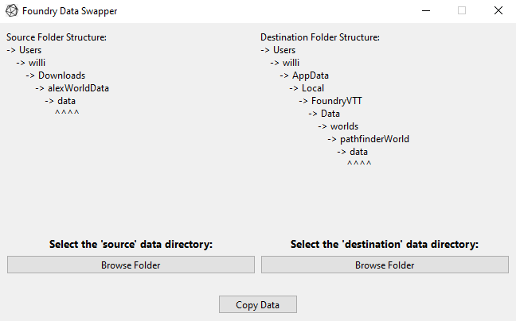

#### Image of what the GUI looks like:

The point of this GUI is to easily copy all of the data within one folder to another folder, in order to share data between two different locally hosted versions of FoundryVTT.

Once data is copied over, a backup data folder is created at the destination directory in case there was a mistake.

Easily made into an executable using PyInstaller by typing `pyinstaller foundryDataSwap.py` in the project directory.